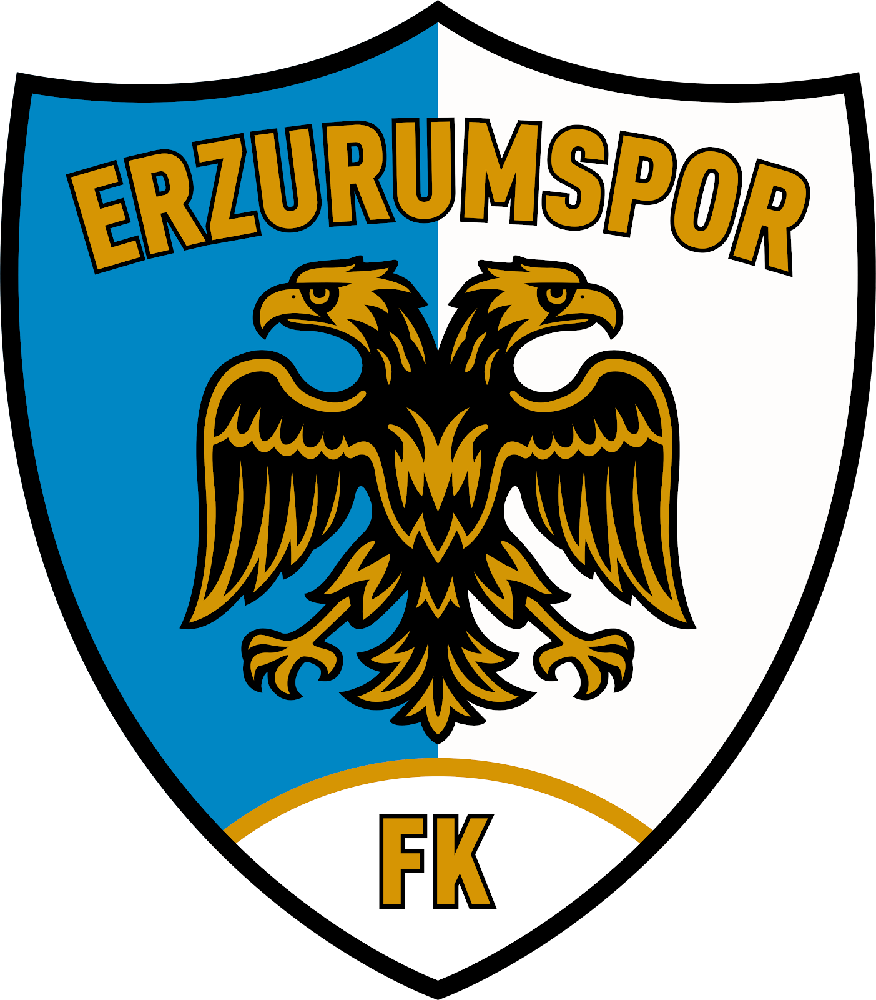

<div align="center">




# Erzurumspor FK

**Official Mobile Application**


[](https://flutter.dev)
[](https://dart.dev)
[](https://firebase.google.com)
[](LICENSE)

</div>

---

## 📱 About

**Erzurumspor FK** is the official mobile application of Erzurumspor FK, built with Flutter for a premium fan experience. The app keeps supporters connected with their club — from live fixture results to exclusive wallpapers — all wrapped in a sleek dark-mode design inspired by the club's iconic gold and navy colors.

> *"Stay close to the club you love — wherever you are."*

---

## ✨ Features

| Feature | Description |
|---|---|
| 🏠 **Home Feed** | Latest news, upcoming match card, and featured banners |
| 📅 **Fixtures & Standings** | Full match schedule and live league table |
| 👥 **Squad** | Player profiles, head coach card, and support staff list |
| 🛍️ **Club Shop** | Browse and explore official club merchandise |
| 🖼️ **Wallpapers** | Download exclusive HD club wallpapers to your device |
| 📲 **Social & Contact** | Quick links to club's official social media channels |

---

## 📸 Screenshots

<div align="center">

| Home | Home | Fixtures |
|------|----------|-------|
|  |  |  |

| Standings | Squad | Squad |
|-----------|------|------------|
|  |  |  |

|  |

</div>

---

## 🏗️ Architecture

The project follows **Clean Architecture** principles with a clear separation of concerns:

```
lib/
├── core/
│   ├── constants/          # App-wide constants (spacing, radius, assets)
│   └── theme/              # Design system (colors, typography, theme)
│
├── data/
│   └── repositories/       # Firebase & mock data sources
│
├── domain/
│   ├── models/             # Pure data models (Player, Match, News…)
│   └── repositories/       # Repository interfaces
│
└── presentation/
    ├── pages/              # Feature screens (home, fixture, squad, shop…)
    └── widgets/            # Shared reusable widgets & drawer
```

### Design Patterns
- **Repository Pattern** — clean data-source abstraction (Firebase ↔ Mock)
- **Widget Composition** — fine-grained, reusable UI components
- **Material Design 3** — full M3 token system with custom dark theme

---

## 🛠️ Tech Stack

### Core
| Package | Purpose |
|---|---|
| [Flutter](https://flutter.dev) | Cross-platform UI framework |
| [Dart 3.9](https://dart.dev) | Language |

### Firebase
| Package | Purpose |
|---|---|
| `firebase_core` | Firebase initialization |
| `cloud_firestore` | News & squad data |
| `firebase_database` | Real-time match data |
| `firebase_storage` | Media assets |

### UI & UX
| Package | Purpose |
|---|---|
| `google_fonts` | Premium typography |
| `flutter_svg` | Vector icon rendering |
| `cached_network_image` | Efficient image loading & caching |
| `font_awesome_flutter` | Social media icons |

### Utilities
| Package | Purpose |
|---|---|
| `url_launcher` | In-app external links |
| `gal` | Save wallpapers to device gallery |
| `path_provider` | File system access |
| `flutter_cache_manager` | Advanced caching layer |

---

## 🌐 Data Sources & API

Match fixtures and league standings are fetched in real-time from **[TheSportsDB](https://www.thesportsdb.com/)** — a free, community-driven sports data API.

| Data | Endpoint | Details |
|---|---|---|
| Upcoming Matches | `eventsnext.php?id=134272` | Next scheduled matches for Erzurumspor FK |
| Past Results | `eventslast.php?id=134272` | Most recent match results |
| League Standings | `lookuptable.php?l=4676` | Trendyol 1. Lig full standings table |

```
Base URL: https://www.thesportsdb.com/api/v1/json/123
Team ID:  134272  (Erzurumspor FK)
League ID: 4676   (Trendyol 1. Lig)
```

> 📰 **News & Squad data** are managed via **Cloud Firestore** for real-time updates without requiring an app release.

---

## 🎨 Design System

The app features a custom **Prestige Dark Theme** built on Material Design 3 tokens:

| Token | Color | Usage |
|---|---|---|
| `primary` |  `#F2CA50` | Gold — CTAs, highlights |
| `secondary` |  `#AFC8F0` | Blue — secondary actions |
| `surface` |  `#131313` | Near-black background |
| `goldStart` |  `#D4AF37` | Gradient start |

---

## 🚀 Getting Started

### Prerequisites

- [Flutter SDK](https://flutter.dev/docs/get-started/install) `>=3.x`
- [Firebase CLI](https://firebase.google.com/docs/cli) configured
- A Firebase project with Firestore, Realtime Database & Storage enabled

### Installation

```bash
# 1. Clone the repository
git clone https://github.com/hsefakcay/ErzurumsporFK-App.git
cd ErzurumsporFK-App

# 2. Install dependencies
flutter pub get

# 3. Add your Firebase configuration
# Place google-services.json → android/app/
# Place GoogleService-Info.plist → ios/Runner/

# 4. Run the app
flutter run
```
---

## 🤝 Contributing

Contributions, issues, and feature requests are welcome!

1. Fork the repository
2. Create your feature branch: `git checkout -b feature/amazing-feature`
3. Commit your changes: `git commit -m 'feat: add amazing feature'`
4. Push to the branch: `git push origin feature/amazing-feature`
5. Open a Pull Request

---

## 👨‍💻 Developer

<div align="center">

**Hüseyin Sefa Akçay**

[](https://github.com/hsefakcay)

</div>

---

<div align="center">

Made with ❤️ for **Erzurumspor FK** fans

⭐ Star this repo if you like the project!

</div>
